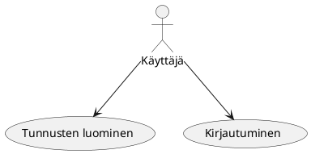
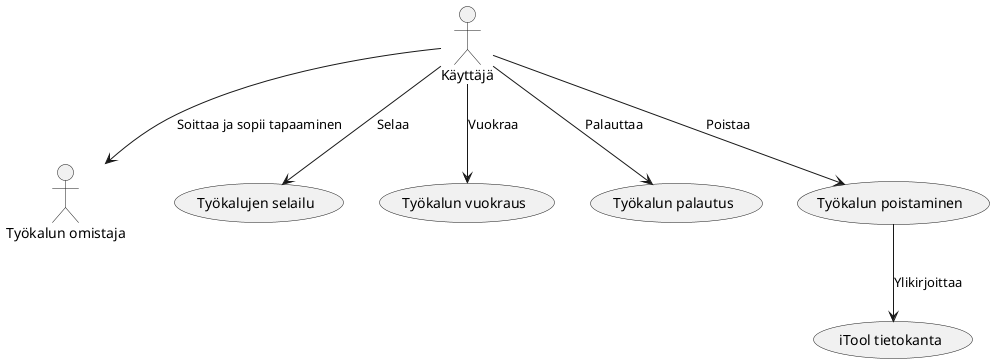
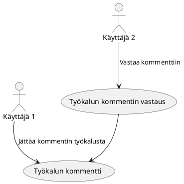
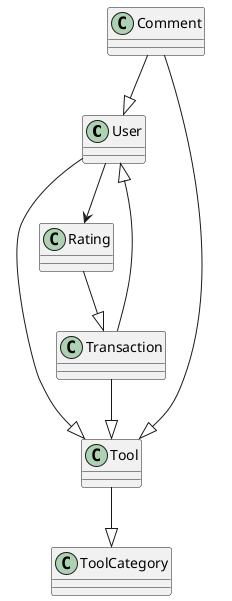
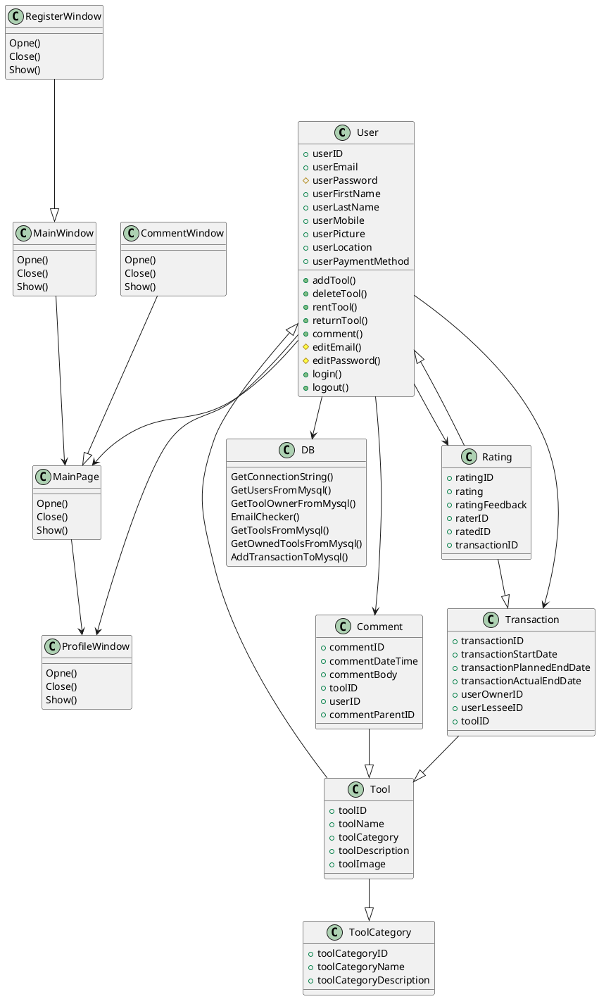

# TTOS0300 (Käyttöliittymäohjelmointi) Kurssin harjoitustyö - iTool

## Tekijä

* Samson Azizyan
* M3156 
* Versionumero 0.1

## Sisällysluettelo 

* [Sovelluksen yleiskuvaus](#sovelluksen-yleiskuvaus)
* [Kohdeyleisö](#kohdeyleisö)
* [Käyttöympäristö ja käytetyt teknologiat](#käyttöympäristö-ja-käytetyt-teknologiat)
* [Käyttäjäroolit](#käyttäjäroolit)
* [Ominaisuudet](#ominaisuudet)
* [Käyttötapaukset](#käyttötapaukset)
* [Hyväksyntätestit](#hyväksyntätestit)
* [Käsitemalli](#käsitemalli)
* [Luokkakaavio](#luokkamalli)
* [Työnjako](#työnjako)
* [Työaikasuunnitelma](#työaika-suunnitelma)

# Sovelluksen yleiskuvaus

Tarkoituksena on suunnitella ja toteuttaa työkaluvuokraussovelluksen prototyyppi,
joka aluksi toimisi vain paikallisesti. Vuokrausmenetelmä toimisi samalla periaatteella kun
Über-sovelluksen kyytipalvelu eli jokainen käyttäjä voi vuokrata jokaisen käyttäjän vuokralle
asettamat työkalut, työkalun omistajan hintapyynnön mukaan. Käyttäjät pystyy kommentoimaan työkaluja
ja antaa 1-5 arvion käyttäjistä, joiden kanssa on suorittanut transaction.

# Kohdeyleisö

Kohdeyleisö on kaikki henkilöt, joilla ei ole monipuolista työkalukokoelmaa. Eli todennäköisesti
kaupungeissa asuvat ihmiset.

# Käyttöympäristö ja käytetyt teknologiat

* Microsoft Windows (Käyttöympäristö)
* Visual Studio 2017
* WPF
* C#
* MySql

# Käyttäjäroolit

## Asiakas

Asiakas käyttää sovellusta vuoratakseen tai laittakseen vuokralle työkaluja.

## Ylläpitäjä

Ylläpitäjä ylläpitää palvelua ja pitää huolta siitä, että työkaluja myöhässä palauttaneiden käyttäjätilit
laitetaan joko jäähylle tai jäädytetään kokonaan.

# Ominaisuudet

| Tunnus | Ominaisuus | Prioriteetti | Muuta |
| :-: | :-: | :-: | :-: |
| FT01 | [ Tunnusten luominen ja kirjautuminen](../liitteet/f1_login.md) | Pakollinen | |
| FT02 | [ Lisää/poistaa työkalu ](../liitteet/f2_tools.md) | Pakollinen | |
| FT03 | [ Tunnusten poistaminen](../liitteet/f3_delete_account.md) | Pakollinen | |
| FT04 | [ Mahdollisuus arvioida käyttäjiä ](../liitteet/f4_rating.md) | Nice to Have | |
| FT05 | [ Työkalujen kommentoiminen ](../liitteet/f5_comment.md) | Nice to Have | |
| FT06 | [ Työkalujen vuokraaminen ](../liitteet/f6_rentatool.md) | Pakollinen | |
| FT07 | [ Työkalujen palautus ](../liitteet/f7_returntool.md) | Pakollinen | |
| FT08 | [ Työkalujen poistaminen ](../liitteet/f8_deletetool.md) | Pakollinen | |

# Käyttötapaukset

## Tunnusten luominen ja kirjautuminen

**Käyttötapauksen kuvaus**

1. Käyttäjä luo tunnukset
2. Käyttäjä kirjautuu palveluun

**Poikkeukset**
 
* P1 Käyttäjä ei täyttänyt kaikki kentät oikein, saa virheilmoituksen
* P2 Käyttäjä ei muista salasanaa, ottaa yhteyttä ylläpitoon
	
**Lopputulos**	

* Asiakas on luonut tunnukset ja on päässyt kirjautumaan iTool sovellukseen

**Käyttötiheys** 

* Tunnusten luominen: Kerran per sähköposti
* Kirjautuminen: rajaton

## Työkalujen selailu, vuokraus, palautus ja poistaminen

**Käyttötapauksen kuvaus**

1. Käyttäjä selaa voukrattavissa olevia työkaluja
2. Käyttäjä ottaa yhteyttä työkalun omistajaan ja sopii tapaaminen
3. Käyttäjä vuokraa työkalun
4. Käyttäjä palauttaa työkalun
5. Käyttäjä poistaa työkalun
6. Sovellus ylikirjoittaa poistetun työkalun

	
**Lopputulos**	

* Asiakas on vuokrannut, palautanut tai poistanut työkalun onnistuneesti

**Käyttötiheys** 

* Vuokraus: rajaton
* Palautus: kerran per transaction
* Poistaminen: kerran per työkalu

## Työkalujen kommentointi

**Käyttötapauksen kuvaus**

1. Käyttäjä 1 jättää kommentin työkalusta
2. Käyttäjä 2 kommentoi Käyttäjä 1:n jättämä kommenttia

	
**Lopputulos**	

* Kommentointi sujuu onnistuneesti

**Käyttötiheys** 

* Kommenttointi: rajaton
* Vastaaminen kommentteihin: rajaton

# Hyväksyntätestit

| TestiID | Kuvaus |								
|:-:|:-:|
| AT01 | [Tunnusten luominen ja sovellukseen kirjautuminen](../liitteet/at1_tunnusten_luominen.md) |
| AT02 | [Työkalun lisäys/poisto](../liitteet/at3_addtool.md) |
| AT03 | [Työkalun vuokraaminen](../liitteet/at4_rentatool.md) |
| AT04 | [Tunnusten poistaminen](../liitteet/at5_delete.md) |
| AT05 | [Kommentointi](../liitteet/at6_comments.md) |
| AT06 | [Työkalun palautus](../liitteet/at7_returnatool.md) |

# Käsitemalli

### Käsitteet

1. User: iTool sovelluksen käyttäj
2. Tool: Työkalu
3. Tool Category: Työkalun kategoria
4. Transaction: Työkalun omistajan ja työkalun vuokraajan välinen kauppa
5. Comment: Työkalujen kommentit
6. Rating: Käyttäjän antama arvio(1-5) kaupan toiselle osapuolelle

# Luokkamalli

# Työnjako

Samson Azizyan
Suunnittelu, XAML toteutus, code in behind, testit, Mysql database (Tietokannat kurssi)

# Työaika suunnitelma

* Viikko 11: MainWindow ja RegisterWindow sekä XAML että code in behind. User, Tool luokat, Mysql tietokanta (15h)
* Viikko 12: DB, MainPage XAML ja code in behind, DB, Mysql (10h)
* Viikko 13: ProfileWindow, DB (5h)
* Viikko 14: Kaikkien ikkunoiden toimintojen parantamista, DB, Harjoitustyön suunnitelmä xD (17h)
* Viikko 15: Kaikkien ikkunoiden toimintojen parantamista, DB, CommentWindow XAML, Mysql näkymät (20h)
* Viikko 16: Rating Window, Testaaminen, debuggaaminen (10h)

Pakko myöntää etää aloin koodaamaan jo viikolla 11 ja tein tämän suunnitelman vasta viikolla 14.