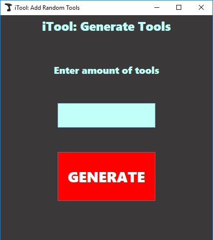

# TTOS0300 (Käyttöliittymäohjelmointi) Kurssin harjoitustyö - iTool

## Tekijä

* Samson Azizyan
* M3156 
* Versionumero 0.1

## Sisällysluettelo 

* [Vaatimusmäärittely](#vaatimusmäärittely)
    * [Sovelluksen yleiskuvaus](#sovelluksen-yleiskuvaus)
    * [Kohdeyleisö](#kohdeyleisö)
    * [Käyttöympäristö ja käytetyt teknologiat](#käyttöympäristö-ja-käytetyt-teknologiat)
    * [Käyttäjäroolit](#käyttäjäroolit)
    * [Ominaisuudet](#ominaisuudet)
    * [Käyttötapaukset](#käyttötapaukset)
    * [Hyväksyntätestit](#hyväksyntätestit)
    * [Käsitemalli](#käsitemalli)
    * [Luokkakaavio](#luokkamalli)
    * [Työnjako](#työnjako)
    * [Työaikasuunnitelma](#työaika-suunnitelma)
* [Loppuraportti](#loppuraportti)
    * [Asennus](#asennus)
    * [Tetoa ohjelmasta](#tietoa-ohjelmasta)
    * [Kuvaruutukaappaukset](#kuvaruutukaappaukset)
    * [Mukana tulevat tiedostot](#)
    * [Tietokanta](#tietokanta)
    * [Ongelmat, jatkokehitysideat](#)
    * [Yhteenveto](#yhteenveto)

# Vaatimusmäärittely

## Sovelluksen yleiskuvaus

Tarkoituksena on suunnitella ja toteuttaa työkaluvuokraussovelluksen prototyyppi,
joka aluksi toimisi vain paikallisesti. Vuokrausmenetelmä toimisi samalla periaatteella kun
Über-sovelluksen kyytipalvelu eli jokainen käyttäjä voi vuokrata jokaisen käyttäjän vuokralle
asettamat työkalut, työkalun omistajan hintapyynnön mukaan. Käyttäjät pystyy kommentoimaan työkaluja
ja antaa 1-5 arvion käyttäjistä, joiden kanssa on suorittanut transaction.

## Kohdeyleisö

Kohdeyleisö on kaikki henkilöt, joilla ei ole monipuolista työkalukokoelmaa. Eli todennäköisesti
kaupungeissa asuvat ihmiset.

## Käyttöympäristö ja käytetyt teknologiat

* Microsoft Windows (Käyttöympäristö)
* Visual Studio 2017
* WPF
* C#
* MySql

## Käyttäjäroolit

### Asiakas

Asiakas käyttää sovellusta vuoratakseen tai laittakseen vuokralle työkaluja.

### Ylläpitäjä

Ylläpitäjä ylläpitää palvelua ja pitää huolta siitä, että työkaluja myöhässä palauttaneiden käyttäjätilit
laitetaan joko jäähylle tai jäädytetään kokonaan.

## Ominaisuudet

| Tunnus | Ominaisuus | Prioriteetti | Muuta |
| :-: | :-: | :-: | :-: |
| FT01 | [ Tunnusten luominen ja kirjautuminen](../liitteet/f1_login.md) | Pakollinen | |
| FT02 | [ Lisää/poistaa työkalu ](../liitteet/f2_tools.md) | Pakollinen | |
| FT03 | [ Tunnusten poistaminen](../liitteet/f3_delete_account.md) | Pakollinen | |
| FT04 | [ Mahdollisuus arvioida käyttäjiä ](../liitteet/f4_rating.md) | Nice to Have | |
| FT05 | [ Työkalujen kommentoiminen ](../liitteet/f5_comment.md) | Nice to Have | |
| FT06 | [ Työkalujen vuokraaminen ](../liitteet/f6_rentatool.md) | Pakollinen | |
| FT07 | [ Työkalujen palautus ](../liitteet/f7_returntool.md) | Pakollinen | |

## Käyttötapaukset

### Tunnusten luominen ja kirjautuminen

**Käyttötapauksen kuvaus**

1. Käyttäjä luo tunnukset
2. Käyttäjä kirjautuu palveluun

**Poikkeukset**
 
* P1 Käyttäjä ei täyttänyt kaikki kentät oikein, saa virheilmoituksen
* P2 Käyttäjä ei muista salasanaa, ottaa yhteyttä ylläpitoon
	
**Lopputulos**	

* Asiakas on luonut tunnukset ja on päässyt kirjautumaan iTool sovellukseen

**Käyttötiheys** 

* Tunnusten luominen: Kerran per sähköposti
* Kirjautuminen: rajaton

### Työkalujen selailu, vuokraus, palautus ja poistaminen

**Käyttötapauksen kuvaus**

1. Käyttäjä selaa voukrattavissa olevia työkaluja
2. Käyttäjä ottaa yhteyttä työkalun omistajaan ja sopii tapaaminen
3. Käyttäjä vuokraa työkalun
4. Käyttäjä palauttaa työkalun
5. Käyttäjä poistaa työkalun
6. Sovellus ylikirjoittaa poistetun työkalun [(CODE002)](liitteet/code002.md)

	
**Lopputulos**	

* Asiakas on vuokrannut, palautanut tai poistanut työkalun onnistuneesti

**Käyttötiheys** 

* Vuokraus: rajaton
* Palautus: kerran per transaction
* Poistaminen: kerran per työkalu

### Työkalujen kommentointi

**Käyttötapauksen kuvaus**

1. Käyttäjä 1 jättää kommentin työkalusta
2. Käyttäjä 2 kommentoi Käyttäjä 1:n jättämä kommenttia

	
**Lopputulos**	

* Kommentointi sujuu onnistuneesti

**Käyttötiheys** 

* Kommenttointi: rajaton
* Vastaaminen kommentteihin: rajaton

### Tunnusten poistaminen

**Käyttötapauksen kuvaus**

1. Käyttäjä poista tunnukset
2. Tunnukset ylikirjoitetaan tietokannassa  [(CODE001)](liitteet/code001.md)

**Lopputulos**	

* Käyttäjän tunnukset on ylikirjoitettu tietokkannassa

**Käyttötiheys** 

* Kerran per sähköposti

## Hyväksyntätestit

| TestiID | Kuvaus |								
|:-:|:-:|
| AT01 | [Tunnusten luominen ja sovellukseen kirjautuminen](../liitteet/at1_tunnusten_luominen.md) |
| AT02 | [Työkalun lisäys/poisto](../liitteet/at3_addtool.md) |
| AT03 | [Työkalun vuokraaminen](../liitteet/at4_rentatool.md) |
| AT04 | [Tunnusten poistaminen](../liitteet/at5_delete.md) |
| AT05 | [Kommentointi](../liitteet/at6_comments.md) |
| AT06 | [Työkalun palautus](../liitteet/at7_returnatool.md) |

## Käsitemalli

### Käsitteet

1. User: iTool sovelluksen käyttäj
2. Tool: Työkalu
3. Tool Category: Työkalun kategoria
4. Transaction: Työkalun omistajan ja työkalun vuokraajan välinen kauppa
5. Comment: Työkalujen kommentit
6. Rating: Käyttäjän antama arvio(1-5) kaupan toiselle osapuolelle

## Luokkamalli

## Työnjako

Samson Azizyan
Suunnittelu, XAML toteutus, code in behind, testit, Mysql database (Tietokannat kurssi)

## Työaika suunnitelma

* Viikko 11: MainWindow ja RegisterWindow sekä XAML että code in behind. User, Tool luokat, Mysql tietokanta (15h)
* Viikko 12: DB, MainPage XAML ja code in behind, DB, Mysql (10h)
* Viikko 13: ProfileWindow, DB (5h)
* Viikko 14: Kaikkien ikkunoiden toimintojen parantamista, DB, Harjoitustyön suunnitelmä xD (17h)
* Viikko 15: Kaikkien ikkunoiden toimintojen parantamista, DB, CommentWindow XAML, Mysql näkymät (20h)
* Viikko 16: Rating Window, Testaaminen, debuggaaminen (10h)

Pakko myöntää etää aloin koodaamaan jo viikolla 11 ja tein tämän suunnitelman vasta viikolla 14.

# Loppuraportti

## Asennus
Sovellus on pakattu zip-pakkaukseen, pakkaus pitää purkkaa sellaisenaan. Hakemistorakenteen pitää olla tasan tarkkaan sellainen kun pakkauksessa, koska sovellus käyttää 'images' - kansiotta
kuvien tallentaamiseen ja esittämiseen.

## Tietoa ohjelmasta

Sovellus on toteutettu suunnitelman mukaan, ei poikennut vaatimusmäärittelystä.

### Toteutetut toiminnalliset vaatimukset

| Tunnus | Ominaisuus | Prioriteetti | Toteuttumisprosentti | Muuta |
| :-: | :-: | :-: | :-: | :-: |
| FT01 | [ Tunnusten luominen ja kirjautuminen](../liitteet/f1_login.md) | Pakollinen | 100% ||
| FT02 | [ Lisää/poistaa työkalu ](../liitteet/f2_tools.md) | Pakollinen | 100% ||
| FT03 | [ Tunnusten poistaminen](../liitteet/f3_delete_account.md) | Pakollinen | 100% ||
| FT04 | [ Mahdollisuus arvioida käyttäjiä ](../liitteet/f4_rating.md) | Nice to Have | 100% ||
| FT05 | [ Työkalujen kommentoiminen ](../liitteet/f5_comment.md) | Nice to Have | 70% | Kommentit ei esinny oikeassa järjestyksessä |
| FT06 | [ Työkalujen vuokraaminen ](../liitteet/f6_rentatool.md) | Pakollinen | 100% ||
| FT07 | [ Työkalujen palautus ](../liitteet/f7_returntool.md) | Pakollinen | 100% ||

### Toteuttamatta jääneet toiminnalliset vaatimukset

Ei jäänyt yhtään toiminnallista ominaisuutta/vaatimusta toteuttamatta, ainoa missä on ongelma on 'kommentit' - ei esinny oikeassa järjestyksessä käyttöliittymässä, muuten toimii.

### Yli alkuperäisten vaatimusten toteutetut toiminnallisuudet

Toteutin piilotetun ikkunan, jossa on toiminnallisuus, joka lisää käyttäjän asettaman määrän satunnaisia työkaluja testaamista varten. Käsiksi siihen ikkunaan pääsee painamalla F1
'AddATool' ikkunan auki ollessa. Sitä ennen 'Register'-ikkunalle tein samantyylisen toiminnallisuuden, joka ei ole niinkään piilotettu. Sieltä löytyy 'Fill'-button, jota klikkamalla
pystyy täyttämään kaikki rekiströintikentät satunnaisilla arvoilla, tämäkin ominaisuus on tehty testaamista varten.

## Kuvaruutukaappaukset

### 'Login'-ikkuna

* Login ikkunassa pystyy kirjautumaan iTool-sovellukseen sisään tai siirtymään rekiströintiin.

### 'Register'-ikkuna

* Register ikkunassa pystyy rekiströitymään iTool-palveluun, kaikki kentät on pakollisia, paitsi kuva.
* Löytyy myös 'Fill' nappi, jota klikkamalla voi täyttää kentät satunnaisilla tiedoilla. Nappi on luotu testausta varten.

### 'Main'-ikkuna

* Mainissa voi selailla ja vuokrata työkaluja.
* Datagridissa työkalua klikkaamalla voi nähdä työkalun kuvan ja tiedot yksityiskohtaisemmin ikkunan alaosassa.
* Vasemmassa laidassa on suodattimia, jotka suodattaa joko sijainnin tai kategorian mukaan.
* Yläpalkista löytyy 'Etsi'-kenttä, jonka avulla voi etsiä työkaluja nimen tai nimen osan mukaan.
* Profiilikuvaa klikkaamalla pääsee siirtymään 'User profile'-ikkunaan.
* Työkalua valitsemalla ja 'Comment'-nappia painamalla aukee 'Comment'-ikkuna.

### 'Commment'-ikkuna

* Comment ikkunassa voi jättää uusia kommentteja koskien kyseistä työkalua
* Voi myös vastata olemassa oleviin kommenteihin klikkaamalla kommenttia
* Kommentit jätetään painamalla 'Enter'-nappia

### 'Profile'-ikkuna

* Profiili-ikkunassa nähdään 3 listaa: "Omat työkalut", "Omat vuokratut työkalut" ja "Omat transaktiot"
* Valitsemalla työkalu "Omat työkalut" listasta ja painamalla 'Delete' nappia voidaan poistaa työkalu kokonaan
* Valitsemalla työkalu "Omat vuokratut työkalut" listasta ja painamalla 'Space' nappia voidaan palauttaa vuokratun työkalun omistajalleen
* Valitsemalla transaktio "Omat transaktiot" listasta ja painamalla 'Space' nappia voidaan antaa transaktion toiselle osapuolelle arvion
* Vasemassa laidassa on palkki, josta pääsee muokkaamaan omaa profiiliä

### 'Edit Profile'-ikkuna

* Edit profile ikkunassa voi muokata omat profiilitiedot

### 'Add a Tool'-ikkuna

* Lisää työkalu - ikkunassa voi lisätä uusia työkaluja
* Kaikki kentä työkalun kuvaa lukuunottamatta ovat pakollisia

### Piilotettu 'Add random tools'-ikkuna

* Add random tools ikkuna on piilotettu ikkuna, johon pääsee käsiksi painamalla 'F1'-nappia "Add a Tool" ikkunan auki ollessa
* Tämä ikkuna oli luotu testaamista varten
* Tämä metodi generoi käyttäjän syöttämän määrän satunnaisia työkaluja kaikkien käyttäjien kesken iTool-tietokantaan

## Mukana tulevat tiedostot

## Tietokanta

Tietokannan suunnittelin tietokannat opintojakson harjoitustyönä. Tietokannasta on luotu 2 versitota prosessin aikana.

### iTool tietokanta versio 1

Tässä versiossa tietokannassa oli tr_completion taulu, se taulu oli työkalun palautusta varten. Käyttäjä palauuttaa työkalun, samalla palautustapahtuma tallentuisi
tr_completion tauluun, johon kirjautuu palautus PVM, palautus kunto ja arvio kaupan toisesta osapuolesta. Transaction ja tr_completion taulujen välissä oli
yksi yhteen liitos, joten tr_completion on jätetty kokonaan pois ja transaction tauluun on lisätty palautusPVM (actualEndDate) kenttä, joka transaction käynnistyessä olisi null. 

### iTool tietokanta lopullinen versio 2

Tässä on lopullinen versio iTool tietokannasta, tr_completion taulu on jätetty pois ja tietokantaan on lisätty rating taulu arvioita varten. Rating taululle on tehty [trigger](liitteet/trigger.md),
joka pitää huolta siitä, että käyttäjä joka jättää arvion voi vain ainoastaan arvioida kyseisen transaktion toista osapuolta yhden kerran. Comment taulussa on itseensä liitos,
koska vastaukset kommenteihin vaatii parentID. 

[Täältä löytyy tietokannan luontiskripti](liitteet/database_script.md)

[Queryhistoriasta](liitteet/queryhistory.md) löytyy näkymien luonti, testidatan lisäys ja erilaisia hakuja. Piti luoda 2 isoa näkymää (all_tools ja rented_tools) käyttöliittymän
toiminnallisuutta varten.

## Ongelmat, jatkokehitysideat

## Yhteenveto